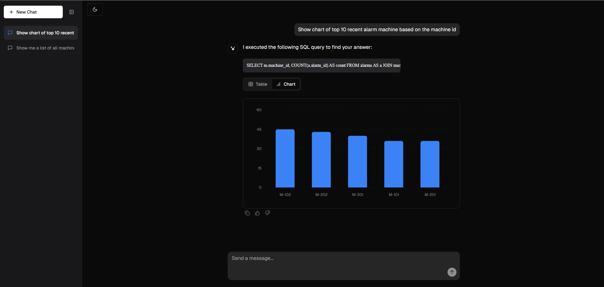
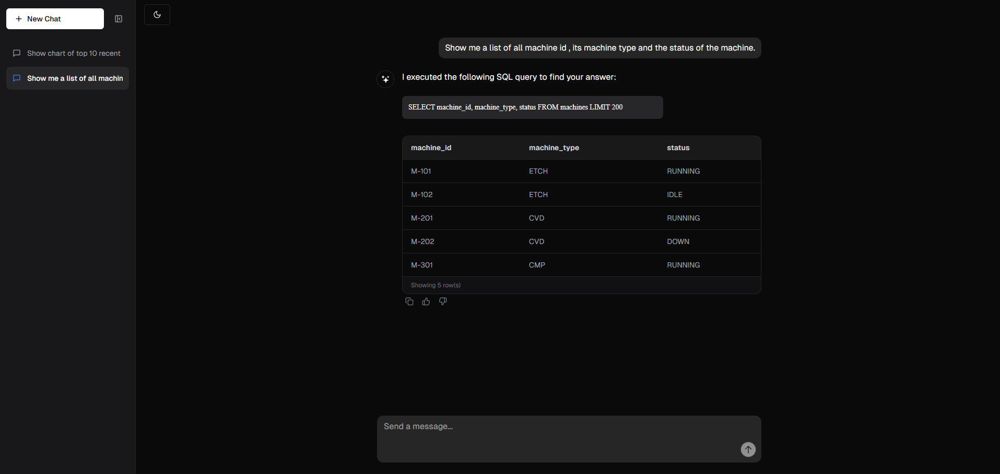

# SQL Database Chatbot

A full-stack application that allows users to query a SQLite database using natural language. It leverages a local Llama 3.2:3b model via Ollama to translate queries to SQL, safely executes only `SELECT` operations, and returns the results to a responsive React frontend.

## Features

- **Conversational Intelligence**: Handles conversational greetings and capabilities queries natively without breaking the SQL flow.
- **Persistent Chat History**: Previous conversations are saved locally and accessible through a sleek, collapsible sidebar. Chats can be deleted easily.
- **Dynamic Charting**: Automatically detects when users ask for charts or distributions and renders beautiful visualizations instead of standard tables.
- **Theme Support**: Seamlessly toggles between sleek Light and Dark mode UIs.

## Architecture

- **Backend**: FastAPI
  - Parses natural language using `ollama`.
  - Validates SQL using `sqlglot` to prevent unauthorized execution (blocks INSERT, UPDATE, DELETE, etc.).
  - Extracts and strips hallucinatory tags, enforcing a strict `LIMIT 200` on all queries.
  - Returns structured JSON to the frontend.
- **Frontend**: React (Vite) + TailwindCSS + Framer Motion
  - Clean, animated, and dynamic chat interface.
  - Automatically renders SQL query results in a beautiful, readable table or dynamic Bar Chart based on context.
- **Database**: SQLite (`mfg_ops.db`)

## Prerequisites

1. Install [Node.js](https://nodejs.org/).
2. Install [Python 3.9+](https://www.python.org/).
3. Install [Ollama](https://ollama.com/) and ensure it is running.

## Local Run Instructions

### 1. Setup Model

Run the included setup script to download the Llama 3.2:3b model for Ollama:
```bat
setup.bat
```

### 2. Run the Backend

Navigate to the `backend` directory, install dependencies, and start the FastAPI server:
```bat
cd backend
python -m venv venv
call venv\Scripts\activate
pip install -r requirements.txt
uvicorn main:app --reload
```
The backend API will run at `http://localhost:8000`.

### 3. Run the Frontend

Navigate to the `ui` directory, install dependencies, and start the development server:
```bat
cd ui
npm install
npm run dev
```
Open the provided `localhost` URL in your browser to interact with the chatbot.

## Examples

### Chatbot Interface


### Generate Chart


### Generate Table

