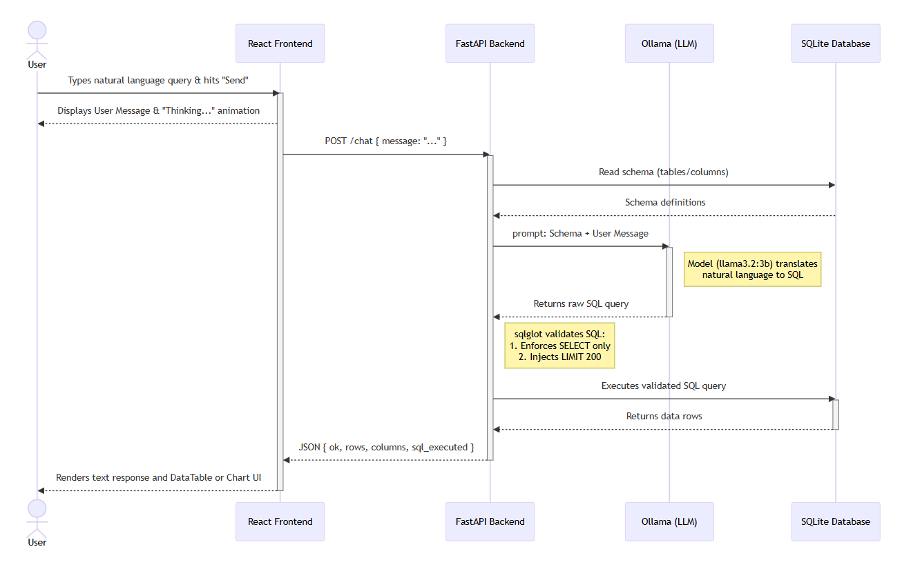
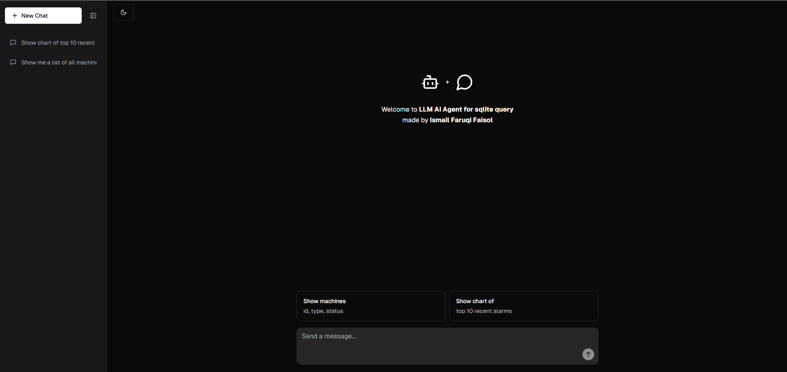
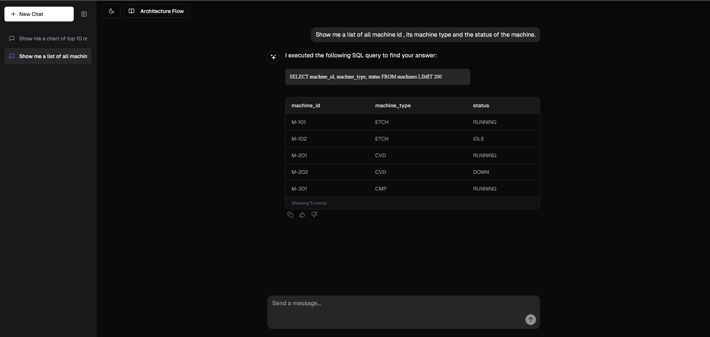

# SQL Database Chatbot

A full-stack application that allows users to query a SQLite database using natural language. It leverages a local Llama 3.2:3b model via Ollama to translate queries to SQL, safely executes only `SELECT` operations, and returns the results to a responsive React frontend.

## Features

- **Conversational Intelligence**: Handles conversational greetings and capabilities queries natively without breaking the SQL flow.
- **Persistent Chat History**: Previous conversations are saved locally and accessible through a sleek, collapsible sidebar. Chats can be deleted easily.
- **Dynamic Charting**: Automatically detects when users ask for charts or distributions and renders beautiful visualizations instead of standard tables.
- **Theme Support**: Seamlessly toggles between sleek Light and Dark mode UIs.

## Architecture & LLM Agent Flow



1. **User Input (React Frontend)**: The user submits a natural language question via the UI.
2. **Context Gathering (FastAPI Backend)**: The backend intercepts the request and reads the live schema (tables/columns) directly from the `mfg_ops.db` SQLite database.
3. **LLM Translation (Ollama)**: The backend sends a carefully crafted system prompt containing the schema and the user's question to the local `llama3.2:3b` model. The LLM acts as the SQL agent to translate the English request into a raw SQL query.
4. **Safety Validation (sqlglot)**: Before execution, the AST parser completely validates the AI-generated SQL to ensure it's safe (see Security section).
5. **Execution & Formatting**: The backend executes the safe query against the database and returns the rows to the frontend as structured JSON.
6. **Dynamic Rendering**: The frontend evaluates the result and renders either a DataTable or a Bar Chart based on the context of the query.

## Security

To safely execute AI-generated queries against the database, the backend implements strict validation using the `sqlglot` Abstract Syntax Tree (AST) parser:
- **Read-Only Enforcement**: Checks the query root to ensure only `SELECT` operations are allowed.
- **Deep AST Inspection**: Recursively walks through the entire query syntax tree to block hidden destructive operations (`INSERT`, `UPDATE`, `DELETE`, `DROP`, `ALTER`, `CREATE`, `REPLACE`, `PRAGMA`, etc.).
- **Single Statement Enforcement**: Automatically blocks multi-statement SQL injection attempts.
- **Hard Row Limits**: Injects or overrides `LIMIT` clauses to enforce a strict maximum of 200 rows per query, preventing database overload.
- **Graceful Error Handling**: Returns structured JSON errors directly to the frontend rather than exposing raw server stack traces.

## Assumptions Made

- The database operations only require data retrieval (Read-Only). No writes are necessary from the chat interface.
- The user will query the database primarily in English.
- The host system has enough resources to run a 3B parameter model locally via Ollama.
- The `mfg_ops.db` schema does not change drastically while the server is running (though it is dynamically extracted).

## Known Limitations

- **Small Model Nuances**: The `llama3.2:3b` is incredibly fast, but being a smaller model, it may occasionally struggle with highly complex analytical queries (like deep nested subqueries or complex window functions) compared to a 70B model.
- **Hallucinations**: Occasionally, the LLM might attempt to query columns that do not exist, resulting in a syntax error passed back to the user.
- **Single-User Scope**: The application uses a local SQLite database and basic chat history state, meaning it is not currently optimized for high-concurrency, multi-user production environments out of the box.

## Prerequisites

1. Install [Node.js](https://nodejs.org/).
2. Install [Python 3.9+](https://www.python.org/).
3. Install [Ollama](https://ollama.com/) and ensure it is running (download first from official website).

## Local Run Instructions

### 1. Setup Environment

Run the included setup script to automatically download the Llama model, create the Python virtual environment, install backend dependencies, and install frontend Node modules:
```bat
setup.bat
```

### 2. Run the Application

Run the included project script to automatically start both the FastAPI backend and the React frontend simultaneously:
```bat
runproject.bat
```
The script will automatically open your browser to the chatbot interface.

---

### Manual Setup & Run (Alternative)

If you prefer to run the components manually without the batch scripts:

**1. Run the Backend**
```bat
cd backend
python -m venv venv
call venv\Scripts\activate
pip install -r requirements.txt
uvicorn main:app --reload
```
The backend API will run at `http://localhost:8000`.

**2. Run the Frontend**
```bat
cd ui
npm install
npm run dev
```
Open the provided `localhost` URL in your browser.

## Examples

### Chatbot Interface


### Generate Chart and Table (Example 1)


### Generate Chart and Table (Example 2)


### Generate Table List

