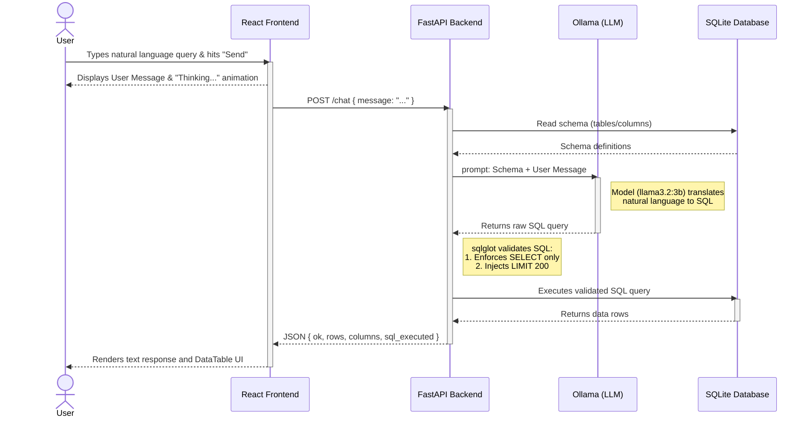

# Request Data Flow

This document outlines the complete lifecycle of a single user request, from the moment they click "Send" in the browser to the moment the final data table is rendered on their screen.

## Sequence Diagram

Here is a visual representation of how the React Frontend, FastAPI Backend, Local LLM, and SQLite database interact with each other.

## Step-by-Step Breakdown

### 1. The Trigger (Frontend)
- **User Action:** The user types a question like "Show me the top 5 products" in the `<ChatInput>` component and presses Enter.
- **State Update:** React immediately adds the user's message to the chat window so they can see what they just typed, and displays a "Thinking..." indicator.

### 2. The Network Request (Frontend $\rightarrow$ Backend)
- **Fetch API:** The `handleSubmit` function in `chat.tsx` sends a `POST` request to `http://localhost:8000/chat` containing the user's text message.

### 3. Gathering Context (Backend)
- **Schema Extraction:** The FastAPI backend (`main.py`) receives the request. Before asking the AI anything, it connects to the `mfg_ops.db` SQLite database and extracts the current schema (table names and column definitions). This provides the AI with the context it needs to write an accurate query.

### 4. AI Translation (Backend $\rightarrow$ Ollama)
- **Prompt Engineering:** FastAPI constructs a prompt combining a system instruction (acting as a SQLite assistant), the database schema, and the user's question.
- **Inference:** This prompt is sent to the local `llama3.2:3b` model running via Ollama. The model translates the English request into a raw SQL query.

### 5. Security & Validation (Backend)
- **AST Parsing:** Before running the SQL, the backend uses a library called `sqlglot` to parse the AI's output.
- **Safety Checks:** It verifies that the query is strictly a `SELECT` statement (blocking destructive `DROP`, `UPDATE`, or `DELETE` commands).
- **Rate Limiting:** It forcefully applies a `LIMIT 200` to the query to ensure the database isn't overwhelmed by massive data requests.

### 6. Database Execution (Backend $\rightarrow$ SQLite)
- **Querying:** The backend executes the sanitized, safe SQL query against the SQLite database and retrieves the rows of data.

### 7. The Response (Backend $\rightarrow$ Frontend)
- **JSON Payload:** The backend formats the data and sends it back to React as a JSON response. The payload includes:
  - `ok`: A success flag.
  - `sql_executed`: The exact SQL string that was run.
  - `columns`: The column headers for the data table.
  - `rows`: The actual database records.

### 8. Rendering the Result (Frontend)
- **State Update:** React receives the JSON and adds a new "assistant" message to the `messages` array in state, embedding the raw data inside the message object.
- **Component Rendering:** The `<PreviewMessage>` component reads this data. It prints out the SQL query that was used, and uses a custom `<DataTable>` component to dynamically render the rows and columns into a clean, readable table on the user's screen.
